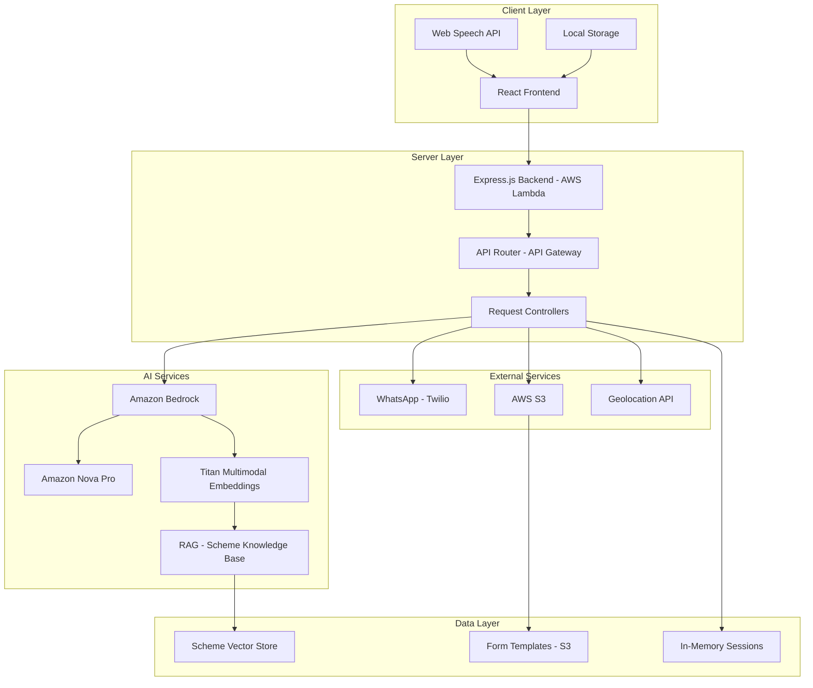
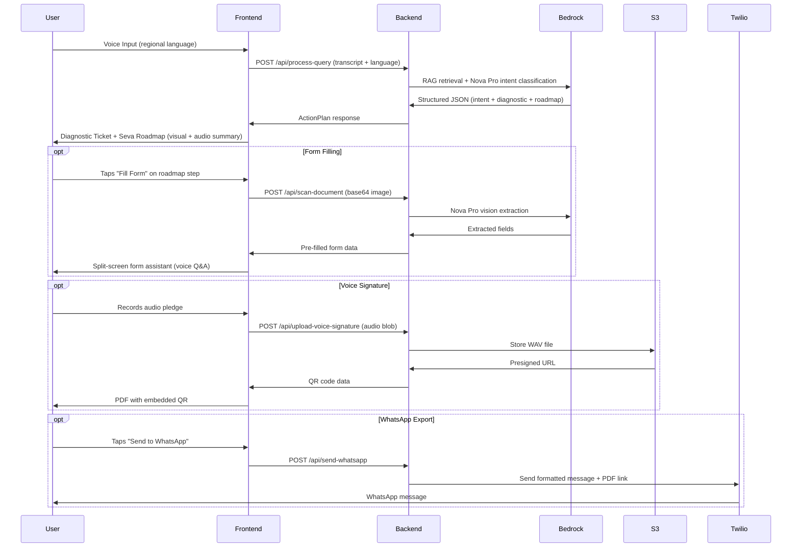

# Design Document: Bharat Seva

## Overview

Bharat Seva is a web-based civic assistant that helps Indian citizens, particularly those in rural areas, navigate government schemes and resolve civic issues. The system follows a client-server architecture where the React frontend provides a voice-first, accessible interface while the Node.js backend orchestrates AI processing through Amazon Bedrock and external service integrations.

The core design philosophy is ruthless simplicity. Every design decision is made in service of a single user type: a rural citizen with low literacy, low tech familiarity, and an unreliable internet connection. This means no decorative animations, no jargon, no complex navigation. The interface does one thing at a time and speaks to the user in their own language.

The system transforms complex government procedures into spoken guidance, visual step-by-step action plans, and pre-filled downloadable forms — all initiated by a single voice input.

---

## Architecture

### High-Level System Architecture



### Component Architecture

The system is organized into four distinct layers:

1. **Presentation Layer**: React components handling voice input, diagnostic display, roadmap rendering, form filling, and export
2. **API Layer**: Express.js routes and controllers on AWS Lambda, fronted by API Gateway
3. **Service Layer**: Business logic for AI orchestration, RAG retrieval, document generation, OCR processing, and geo-routing
4. **Integration Layer**: Connectors for Amazon Bedrock, AWS S3, Twilio, and the Geolocation API

### Data Flow



---

## UI Design Philosophy

### Core Principle: One Thing at a Time

Rural users are not experienced with multi-panel dashboards or scrollable content. Every screen in Bharat Seva shows one primary thing. The user completes it and moves forward. There is no sidebar, no tab bar, no floating menu unless absolutely necessary.

### Visual Language

- **No decorative animations.** State transitions use simple opacity fades (200ms). The only motion is functional: a recording indicator pulses to show the mic is active. Nothing else moves for aesthetic reasons.
- **No emojis or icons as primary communication.** Icons are used only as supporting elements alongside text labels. A rural user cannot be expected to interpret icon-only buttons.
- **Large touch targets.** All interactive elements are a minimum of 56px tall on mobile. Primary buttons span the full width of the screen.
- **High contrast, flat design.** Text on white backgrounds. No gradients, no glassmorphism, no drop shadows except a single 1px border to define cards.
- **Font sizes for low-vision users.** Body text minimum 18px. Primary action labels 20px. Headings 24px.

### Color Usage

Colors carry meaning and are used sparingly:

| Color | Hex | Meaning |
|---|---|---|
| Deep Blue | #1E3A8A | Brand, headers, primary actions |
| Saffron Orange | #EA580C | Active state, recording, urgent CTA |
| Forest Green | #15803D | Completed steps, success states |
| Amber | #B45309 | In-progress, documents needed |
| Crimson | #B91C1C | High urgency, errors, rejections |
| Off-white | #FAFAF9 | Page background |
| White | #FFFFFF | Card backgrounds |
| Dark slate | #1E293B | All body text |
| Mid gray | #64748B | Secondary labels |

Color is never the only signal. Every colored state is accompanied by a text label or icon.

### Typography

| Element | Font | Size | Weight |
|---|---|---|---|
| Brand name | Samarkan (self-hosted) | 26px | Regular |
| Page headings | Noto Sans | 22px | Bold |
| Step titles | Noto Sans | 20px | SemiBold |
| Body / descriptions | Noto Sans | 18px | Regular |
| Form labels | Noto Sans | 16px | Medium |
| Secondary labels | Noto Sans | 14px | Regular |

Noto Sans is used for all Indic script rendering. It includes Devanagari, Tamil, Telugu, Kannada, Bengali, Gujarati, and Odia subsets. All subsets are loaded only when the corresponding language is selected (dynamic import).

---

## Screen Specifications

### Screen 1: Onboarding Splash (First Visit Only)

A full-screen dark background. The word "Welcome" appears in one Indian language at a time, cycling through 10 languages at 250ms per word. No animation other than a clean opacity crossfade between words. After the last word, the screen fades to the home page over 400ms.

A `hasSeenOnboarding` flag in localStorage prevents this from showing on repeat visits.

Languages shown in order: Hindi, Telugu, Tamil, Kannada, Marathi, Gujarati, Punjabi, Bengali, Odia, Urdu.

---

### Screen 2: Home Page

```
+--------------------------------------------------+
|  Bharat Seva            [Language: Hindi    v]   |
+--------------------------------------------------+
|                                                  |
|                                                  |
|                    [ MIC ]                       |
|             (large, circular button)             |
|                                                  |
|         Apni samasya bataiye. Hum sunenge.       |
|                                                  |
|                                                  |
|         [ Sarkaari patr padhna hai? ]            |
|           (secondary text button, no box)        |
+--------------------------------------------------+
```

The mic button is a plain circle, 88px diameter, saffron background, white microphone icon. It does not pulse at rest. When recording, a thin saffron ring around it pulses once per second.

The language dropdown in the top right contains the 10 supported languages. Selecting a language immediately re-renders all UI text and sets the TTS language.

The secondary link at the bottom is plain text with an underline. No icon, no card, no border. Tapping it opens the Notice Reader flow.

---

### Screen 3: Processing State

After the user stops speaking, the mic button is replaced by a centered loading indicator (three dots, animated left-to-right, 600ms cycle) and a single line of text that updates every 1.5 seconds:

- "Samajh raha hoon..."
- "Scheme dhundh raha hoon..."
- "Jawab taiyaar kar raha hoon..."

No orb morphing. No particle effects. Just text and a simple loader.

---

### Screen 4: Diagnostic Ticket

Displayed as a plain card with a left border colored by severity. The card contains four text fields arranged in a 2x2 grid. No icons as primary elements.

```
+--------------------------------------------------+
| [RED LEFT BORDER]  Samasya Pahchaani Gayi        |
|                                                  |
|  Kya hua:           Vidhwa Pension Ruk Gayi      |
|  Kyon hua:          Jeevan Pramaan Nahi Mila     |
|  Kaun zimmedar:     Samajik Kalyan Vibhag        |
|  Kahan atka hai:    Bank Shakha                  |
+--------------------------------------------------+
```

Border colors: Crimson for high urgency, Amber for medium, Forest Green for low/informational.

The card appears on screen with a plain opacity fade (0 to 1, 300ms). Below it, after a 500ms pause, the Seva Roadmap fades in.

When the roadmap loads, TTS auto-plays a one-sentence summary: "Aapki pension is liye ruki hai kyunki Jeevan Pramaan nahi mila. Teen kaam karne honge."

---

### Screen 5: Seva Roadmap

A vertical list of step cards connected by a thin vertical line. Each step card is a plain rectangle with a step number, title, and status indicator.

```
  |
  o  Step 1: Kagaz Ikkathe Karein              [Karna Baaki]
  |    > tap to expand
  |
  o  Step 2: Form Bharein                      [Karna Baaki]
  |    > [Form Bharein - button]
  |
  o  Step 3: BDO Office Mein Jama Karein       [Karna Baaki]
  |    > [Nazdeeki Office Dikhayein - button]
  |
```

The connecting line is a simple 1px gray vertical rule. Completed steps show a green circle. Pending steps show a gray circle. In-progress steps show an amber circle.

Tapping a step card expands it inline to show sub-steps as a plain bulleted list. Tapping again collapses it. No slide animation — a simple height change with 150ms ease.

Steps with `type: "form"` show a full-width primary button: "Form Bharein"
Steps with `type: "location"` show a full-width secondary button: "Nazdeeki Office Dikhayein"

At the bottom of the roadmap, three full-width action buttons stacked vertically:

```
[ PDF Download Karein        ]
[ WhatsApp Par Bhejein       ]
[ Sahayak Se Poochhein       ]
```

---

### Screen 6: Smart Form Assistant

A two-panel screen. On mobile, the form preview is in a scrollable top panel (40% of screen height). The voice assistant occupies the bottom 60%.

On desktop, left panel (55%) shows the form. Right panel (45%) shows the assistant.

The form panel shows the actual PDF rendered as an image. The currently active field is highlighted with a 2px saffron border. Filled fields have a light green background (#F0FDF4).

The assistant panel contains:
- A single question in large text (20px)
- A progress indicator: "Sawaal 3 / 8"
- A full-width "Jawab Dein" button (hold to record)
- A small "Badalna Hai?" link below it for corrections

No chat bubbles. No conversation history visible during filling. One question at a time, full width.

Before filling begins, a single prompt appears: "Kya aapke paas Aadhaar card hai? Scan karein toh 80% form khud bhar jayega." with two buttons: "Scan Karein" and "Seedha Shuru Karein".

---

### Screen 7: Voice Signature

A single centered screen. The pledge text is shown in large font (22px). Below it, a full-width button: "Mic Dabayein Aur Bolein". The user holds the button and speaks. A simple recording timer counts up. On release, the upload begins and a loading indicator replaces the button.

No decorative elements. No waveform visualization.

---

### Screen 8: Export and Last Mile Card

Three stacked download/share buttons at the top (same as roadmap bottom toolbar).

Below a horizontal divider, the Last Mile Card:

```
+--------------------------------------------------+
|  Kahan Jaana Hai                                 |
|  Block Development Office, Fatehpur              |
|  [Maps Mein Dekho]                               |
|                                                  |
|  Kab Jaana Hai                                   |
|  Subah 9 baje se dopahar 1 baje tak              |
|  Somwar se Shanivaar                             |
|                                                  |
|  Kya Le Jaana Hai                                |
|  - Aadhaar Card (asli)                           |
|  - Mrityu Praman Patra (asli)                    |
|  - 2 Passport Photo                              |
|  - Yeh PDF (print karke)                         |
+--------------------------------------------------+
```

Plain card, 1px border, no shadow. All text in simple language.

---

### Screen 9: Notice Reader

Camera opens full screen. A thin rectangular overlay (not filled, just a border) in the center of the viewfinder guides the user to position the letter. A single button at the bottom: "Photo Lo".

After capture, the processing state (three-dot loader) appears. Then a results screen:

- Section heading: "Patr Ka Matlab" (What the letter means)
- Summary text in large font, plain language
- TTS auto-plays immediately
- Below a divider: "Kya Karna Hai?" section showing the required action
- A button at the bottom: "Aage Ki Madad Chahiye?" which re-enters the main workflow

---

## Components and Interfaces

### Frontend Components

#### DiagnosticTicket Component
- **Purpose**: Displays the AI-diagnosed issue as a structured card
- **Props**: `analysis: ProblemAnalysis`, `language: string`
- **State**: None (pure display)
- **Key Features**: Severity-based left border color, 2x2 grid layout, plain text labels in selected language

#### SevaRoadmap Component
- **Purpose**: Renders the action plan as a vertical step-by-step pathway
- **Props**: `steps: ActionStep[]`, `language: string`, `onFormStepClick: (stepId) => void`, `onLocationStepClick: (stepId) => void`
- **State**: `expandedStepId`, `completedSteps[]`
- **Key Features**: Expandable sub-steps, inline CTAs for form and location steps, TTS summary on mount

#### VoiceInterface Component
- **Purpose**: Handles voice input using Web Speech API with Bhashini fallback
- **Props**: `onVoiceInput: (text: string) => void`, `language: string`
- **State**: `isRecording`, `transcript`, `error`
- **Key Features**: Single large button, simple pulse ring on active recording, fallback text input

#### SmartFormAssistant Component
- **Purpose**: Manages conversational form filling in split-screen mode
- **Props**: `formId: string`, `formTemplateUrl: string`, `language: string`, `onComplete: (filledData) => void`
- **State**: `currentQuestionIndex`, `answers`, `scannedFields`, `activeFieldId`
- **Key Features**: Voice Q&A loop, field highlighting on PDF preview, smart scan pre-fill

#### SmartScanCamera Component
- **Purpose**: Captures and processes identity documents via camera
- **Props**: `expectedDocumentType: string`, `language: string`, `onSuccess: (fields) => void`, `onRejection: (message) => void`
- **State**: `captureState`, `processingState`
- **Key Features**: Viewfinder overlay, bouncer rejection feedback, extracted field preview

#### VoiceSignature Component
- **Purpose**: Records and uploads the user's audio consent
- **Props**: `language: string`, `pledgeText: string`, `onComplete: (qrData) => void`
- **State**: `isRecording`, `recordingDuration`, `uploadState`
- **Key Features**: Hold-to-record button, upload to S3, QR code generation

#### NoticeReader Component
- **Purpose**: Camera-based government letter OCR and simplification
- **Props**: `language: string`, `onActionRequired: (actionType) => void`
- **State**: `captureState`, `summary`, `audioPlaying`
- **Key Features**: Camera viewfinder with guide overlay, TTS auto-play on result, re-entry into main workflow

#### LastMileCard Component
- **Purpose**: Shows the nearest relevant office and what to carry
- **Props**: `officeData: OfficeInfo`, `documents: string[]`, `language: string`
- **State**: None (pure display)
- **Key Features**: Plain card layout, Maps deeplink, document checklist

#### ContextSahayak Component
- **Purpose**: Context-aware chatbot available throughout the workflow
- **Props**: `currentStep: ActionStep`, `actionPlan: ActionPlan`, `language: string`
- **State**: `isOpen`, `messages[]`, `isLoading`
- **Key Features**: Context pre-seeded with current step, voice + text input, bottom sheet on mobile

#### ExportToolbar Component
- **Purpose**: Renders the three export action buttons
- **Props**: `actionPlan: ActionPlan`, `filledFormData?: FormData`, `language: string`
- **State**: `whatsappStatus`, `downloadStatus`
- **Key Features**: PDF generation via pdfmake, WhatsApp via Twilio, stacked full-width buttons

---

### Backend Services

#### QueryService
- **Purpose**: Orchestrates the full intent-to-response pipeline for voice queries
- **Methods**:
  - `processQuery(transcript: string, language: string, userContext: UserContext): Promise<ActionPlanResponse>`
  - `classifyIntent(transcript: string): Promise<IntentCategory>`
- **Dependencies**: BedrockService, RAGService

#### BedrockService
- **Purpose**: Interfaces with Amazon Bedrock (Nova Pro and Titan)
- **Methods**:
  - `generateStructuredResponse(prompt: string, schema: JSONSchema): Promise<StructuredResponse>`
  - `extractDocumentFields(imageBase64: string, expectedType: string): Promise<ExtractionResult>`
  - `simplifyNotice(imageBase64: string, language: string): Promise<NoticeSummary>`
- **Configuration**: Model IDs for Nova Pro, Nova Lite, Titan Multimodal

#### RAGService
- **Purpose**: Retrieval-augmented generation using official scheme PDFs
- **Methods**:
  - `retrieveSchemeContext(query: string): Promise<string>`
  - `indexSchemeDocument(pdfBuffer: Buffer, schemeId: string): Promise<void>`
- **Dependencies**: Titan Embeddings via Bedrock, vector store (Pinecone or local JSON)

#### FormService
- **Purpose**: Manages form template retrieval and field mapping
- **Methods**:
  - `getFormTemplate(formId: string): Promise<FormTemplate>`
  - `generateFilledPDF(formId: string, answers: Record<string, string>): Promise<Buffer>`
- **Dependencies**: AWS S3, pdfmake

#### VoiceSignatureService
- **Purpose**: Handles audio upload and QR code generation
- **Methods**:
  - `uploadAudioSignature(audioBlob: Buffer, metadata: SignatureMetadata): Promise<SignatureResult>`
  - `generateQRCode(url: string): Promise<string>`
- **Dependencies**: AWS S3 SDK

#### GeoRoutingService
- **Purpose**: Finds the nearest relevant government office
- **Methods**:
  - `findNearestOffice(lat: number, lng: number, officeType: string): Promise<OfficeInfo>`
  - `getOfficeInfo(districtCode: string, officeType: string): Promise<OfficeInfo>`
- **Dependencies**: Google Maps Places API, static district office database

#### WhatsAppService
- **Purpose**: Sends action plan summaries and PDF links via WhatsApp
- **Methods**:
  - `sendActionPlan(phoneNumber: string, actionPlan: ActionPlan, pdfUrl: string): Promise<MessageResult>`
  - `formatMessage(actionPlan: ActionPlan, language: string): string`
- **Dependencies**: Twilio SDK

#### DocumentService
- **Purpose**: Generates offline-ready Smart Documents
- **Methods**:
  - `generateSmartPDF(actionPlan: ActionPlan, filledForm?: FormData, signatureQR?: string): Promise<Buffer>`
  - `uploadToS3(buffer: Buffer, key: string): Promise<string>`
- **Dependencies**: pdfmake, AWS S3 SDK

---

### API Endpoints

#### POST /api/process-query
- **Purpose**: Primary endpoint. Receives voice transcript, returns full action plan.
- **Request**: `{ transcript: string, language: string, userContext: { state: string, district: string } }`
- **Response**: Full `ActionPlanResponse` object
- **Error Handling**: Bedrock service failure, unsupported language, empty transcript

#### POST /api/scan-document
- **Purpose**: OCR extraction from identity document photo
- **Request**: `{ imageBase64: string, expectedDocumentType: string, language: string }`
- **Response**: `{ isCorrectDocument: boolean, extractedFields: object, rejectionMessage?: string }`
- **Error Handling**: Unreadable image, wrong document type, low confidence extraction

#### POST /api/read-notice
- **Purpose**: Simplifies government letter photo into plain-language summary
- **Request**: `{ imageBase64: string, language: string }`
- **Response**: `{ simplifiedSummary: string, actionRequired: boolean, actionType?: string, deadline?: string }`
- **Error Handling**: Unreadable image, non-government document detected

#### POST /api/upload-voice-signature
- **Purpose**: Uploads audio pledge to S3, returns presigned URL and QR data
- **Request**: `multipart/form-data` with audio blob, formId, timestamp
- **Response**: `{ presignedUrl: string, qrCodeData: string, expiresAt: string }`
- **Error Handling**: S3 upload failure, audio too short, audio too long

#### POST /api/send-whatsapp
- **Purpose**: Sends formatted action plan to user's WhatsApp
- **Request**: `{ phoneNumber: string, actionPlan: ActionPlan, pdfS3Url: string }`
- **Response**: `{ success: boolean, messageId?: string, error?: string }`
- **Error Handling**: Invalid phone number, Twilio failure, message too long

#### POST /api/geo-route
- **Purpose**: Returns nearest relevant office based on coordinates
- **Request**: `{ lat: number, lng: number, officeType: string, schemeType: string }`
- **Response**: `OfficeInfo` object with address, maps link, hours, documents to carry
- **Error Handling**: Coordinates out of India bounds, unknown office type, no offices found in range

#### POST /api/context-chat
- **Purpose**: Contextual Sahayak chatbot — answers questions within current workflow context
- **Request**: `{ message: string, language: string, currentStepId: number, actionPlanId: string, conversationHistory: Message[] }`
- **Response**: `{ reply: string, audioText: string, relatedDocuments?: string[] }`
- **Error Handling**: Missing action plan context, Bedrock failure, session expired

---

## Data Models

### Core Data Structures

#### ActionPlanResponse
```typescript
interface ActionPlanResponse {
  intent: 'ACTION' | 'DISCOVERY' | 'NOTICE_READ' | 'QA';
  language: string;
  problemAnalysis?: ProblemAnalysis;
  audioSummary: string;
  steps: ActionStep[];
  requiredDocuments: RequiredDocument[];
}
```

#### ProblemAnalysis
```typescript
interface ProblemAnalysis {
  detectedIssue: string;
  rootCause: string;
  department: string;
  bottleneckLevel: string;
  severityColor: 'red' | 'amber' | 'green';
}
```

#### ActionStep
```typescript
interface ActionStep {
  id: number;
  title: string;
  description: string;
  type: 'info' | 'checklist' | 'form' | 'location';
  status: 'complete' | 'in_progress' | 'pending';
  subSteps: string[];
  formId?: string;
  formTemplateUrl?: string;
  officeType?: string;
}
```

#### RequiredDocument
```typescript
interface RequiredDocument {
  name: string;
  description: string;
  isRequired: boolean;
  obtainFrom: string;
}
```

#### ExtractionResult
```typescript
interface ExtractionResult {
  isCorrectDocument: boolean;
  documentTypeDetected: string;
  extractedFields: {
    name?: string;
    dob?: string;
    address?: string;
    idNumber?: string;
    accountNumber?: string;
    ifscCode?: string;
  };
  confidence: number;
  rejectionMessage?: string;
}
```

#### OfficeInfo
```typescript
interface OfficeInfo {
  officeName: string;
  address: string;
  mapsLink: string;
  distanceKm: number;
  workingHours: string;
  avoidDays: string;
  documentsToCarry: string[];
}
```

#### UserSession
```typescript
interface UserSession {
  sessionId: string;
  language: string;
  currentActionPlan?: ActionPlanResponse;
  conversationHistory: Message[];
  createdAt: Date;
  lastActivity: Date;
}
```

### AI Response Schema (Bedrock / Nova Pro)

```json
{
  "type": "object",
  "required": ["intent", "language", "audioSummary", "steps", "requiredDocuments"],
  "properties": {
    "intent": { "type": "string", "enum": ["ACTION", "DISCOVERY", "NOTICE_READ", "QA"] },
    "language": { "type": "string" },
    "audioSummary": { "type": "string" },
    "problemAnalysis": {
      "type": "object",
      "properties": {
        "detectedIssue": { "type": "string" },
        "rootCause": { "type": "string" },
        "department": { "type": "string" },
        "bottleneckLevel": { "type": "string" },
        "severityColor": { "type": "string", "enum": ["red", "amber", "green"] }
      }
    },
    "steps": {
      "type": "array",
      "items": {
        "type": "object",
        "required": ["id", "title", "description", "type", "status"],
        "properties": {
          "id": { "type": "number" },
          "title": { "type": "string" },
          "description": { "type": "string" },
          "type": { "type": "string", "enum": ["info", "checklist", "form", "location"] },
          "status": { "type": "string", "enum": ["complete", "in_progress", "pending"] },
          "subSteps": { "type": "array", "items": { "type": "string" } },
          "formId": { "type": "string" },
          "officeType": { "type": "string" }
        }
      }
    },
    "requiredDocuments": {
      "type": "array",
      "items": {
        "type": "object",
        "properties": {
          "name": { "type": "string" },
          "description": { "type": "string" },
          "isRequired": { "type": "boolean" },
          "obtainFrom": { "type": "string" }
        }
      }
    }
  }
}
```

---

## Technical Architecture

### Frontend Stack

| Technology | Version | Purpose |
|---|---|---|
| React.js | 18.x | UI framework |
| Vite | 5.x | Build tool |
| Tailwind CSS | 3.x | Utility-first styling |
| Web Speech API | Browser-native | STT and TTS |
| MediaRecorder API | Browser-native | Voice signature recording |
| pdfmake | 0.2.x | Client-side PDF generation |
| qrcode.react | 3.x | QR code generation |

No animation library. Framer Motion is not used. All transitions are CSS transitions (opacity, height) with durations under 300ms.

### Backend Stack

| Technology | Version | Purpose |
|---|---|---|
| Node.js | 20.x LTS | Lambda runtime |
| Express.js | 4.x | HTTP routing |
| serverless-http | 3.x | Lambda adapter |
| AWS SDK v3 | Latest | S3, Bedrock operations |
| Twilio SDK | Latest | WhatsApp messaging |
| sharp | 0.33.x | Image preprocessing before OCR |

### Infrastructure

| Service | Configuration | Purpose |
|---|---|---|
| AWS Lambda | Node.js 20.x, 512MB RAM, 30s timeout | Serverless backend |
| AWS API Gateway | HTTP API v2, CORS enabled | Routing and rate limiting |
| AWS S3 | Private bucket | Form templates, PDFs, voice signatures |
| Amazon Bedrock | ap-south-1 (Mumbai) | Nova Pro, Titan Embeddings |

---

## Error Handling

### AI Service Failures
- **Bedrock unavailable**: Return cached response for common scheme queries. Display plain message: "Abhi jawab nahi mil raha. Thodi der mein dobara koshish karein."
- **Low confidence response**: Re-prompt with clarification request before showing result
- **Language detection failure**: Default to Hindi, prompt user to confirm language

### External Service Failures
- **Twilio failure**: Show error with alternative: "WhatsApp nahi gaya. PDF download karein."
- **S3 upload failure**: Retry once. On second failure, generate QR-less PDF and inform user.
- **Geolocation denied**: Show manual district and block selector dropdown

### Input Failures
- **Inaudible recording**: Show message: "Awaaz sunai nahi di. Dobara bolein." with retry button
- **Wrong document scanned**: Show plain rejection message from bouncer logic
- **Network drop after AI response**: PDF generation runs client-side and does not require reconnection

### Data Integrity
- Validate all Bedrock responses against the JSON schema before rendering
- If schema validation fails, re-request once before showing a generic error
- Maintain language consistency across all responses within a session

---

## Correctness Properties

### Property 1: Language Detection Accuracy
For any text input in a supported Indian language, the language detection should correctly identify the language before routing to the AI model.

### Property 2: Intent Classification Completeness
For any user input related to government services, the system should classify it into one of four intent categories (ACTION, DISCOVERY, NOTICE_READ, QA) without returning null.

### Property 3: Language Preservation Across Services
For any session in a specific language, all responses — AI text, TTS audio, WhatsApp messages, PDF content — must remain in that language throughout.

### Property 4: Supported Language Coverage
For each of the 10 supported languages, the system should successfully process voice input and return a structured response.

### Property 5: Action Plan Step Count Bounds
For any valid government scheme query, the generated action plan must contain between 3 and 8 steps.

### Property 6: Step Sequential Ordering
For any generated action plan, steps must be numbered sequentially from 1 with no gaps or duplicates.

### Property 7: Form Step Integrity
For any step with type "form", a valid formId and formTemplateUrl must be present in the step data.

### Property 8: Location Step Integrity
For any step with type "location", a valid officeType must be present to enable geo-routing.

### Property 9: OCR Extraction Schema Compliance
For any document scan response, the extractedFields object must conform to the defined schema and confidence must be a value between 0 and 1.

### Property 10: Bouncer Rejection Clarity
For any document scan where the wrong document type is submitted, a non-null rejectionMessage in the user's language must be returned.

### Property 11: Voice Signature Duration Bounds
For any voice signature recording, the audio must be between 3 and 15 seconds in length before upload proceeds.

### Property 12: QR Code URL Validity
For any generated voice signature, the QR code must encode a valid presigned S3 URL that resolves to the uploaded audio file.

### Property 13: PDF Generation Completeness
For any completed action plan, the generated Smart PDF must include all steps, required documents, and (if applicable) the voice signature QR code.

### Property 14: WhatsApp Message Length
For any action plan sent via WhatsApp, the formatted message must stay within Twilio's 1600-character limit per message.

### Property 15: Context Chat Step Awareness
For any context chat query, the system prompt passed to Bedrock must include the current step data and action plan context.

### Property 16: Geo-Routing Coordinate Bounds
For any geo-routing request, the latitude must be between 8.0 and 37.6 and longitude between 68.1 and 97.4 (India bounding box). Requests outside this range must return a validation error.

### Property 17: Safety Filter Application
For any user input, the safety filter must be applied before the Bedrock call. Harmful inputs must be blocked and a plain explanation returned.

### Property 18: Cross-Language Safety Consistency
For any harmful content input across all 10 supported languages, the safety filter must block the request regardless of language.

### Property 19: API Schema Compliance
For any API response, the returned JSON must conform to the defined schema with all required fields present and correctly typed.

### Property 20: Offline PDF Availability
For any completed session, the Smart PDF must be generatable entirely client-side from the last received AI payload, without requiring a network request.

---

## Testing Strategy

### Dual Testing Approach

Unit tests validate specific scheme examples, edge cases, and integration points. Property-based tests validate universal behaviors across all supported languages, input types, and response structures.

**Testing Framework**: `fast-check` for property-based tests, `vitest` for unit tests
**Minimum iterations per property test**: 100
**Test tagging format**: `// Feature: bharat-seva, Property N: [description]`

### Key Testing Areas

**Language and Voice Processing**
- Property tests for language detection across all 10 supported languages
- Unit tests for mixed-language inputs and dialect variations
- Integration tests for Web Speech API fallback to text input

**AI Integration (Bedrock)**
- Property tests for Nova Pro response schema compliance
- Unit tests for specific scheme examples (PM-KISAN, Widow Pension, Ayushman Bharat)
- Mock tests for Bedrock unavailability and fallback behavior

**Document Processing**
- Property tests for OCR extraction schema across all supported document types
- Unit tests for bouncer rejection logic with wrong document types
- Unit tests for low-quality image handling via sharp preprocessing

**Form Filling**
- Unit tests for voice Q&A loop progression and field mapping
- Property tests for PDF field population completeness
- Integration tests for smart scan pre-fill accuracy

**Export and Delivery**
- Property tests for WhatsApp message character limit compliance
- Unit tests for PDF generation with and without voice signature QR
- Unit tests for S3 upload failure and retry logic

**Safety and Validation**
- Property tests for safety filter consistency across all languages
- Unit tests for API schema validation and rejection of malformed responses
- Unit tests for geo-routing coordinate bounds enforcement