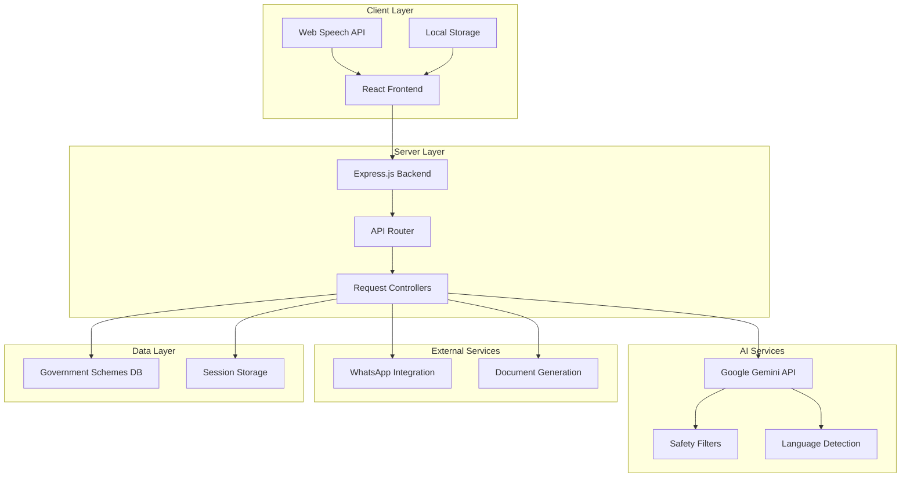
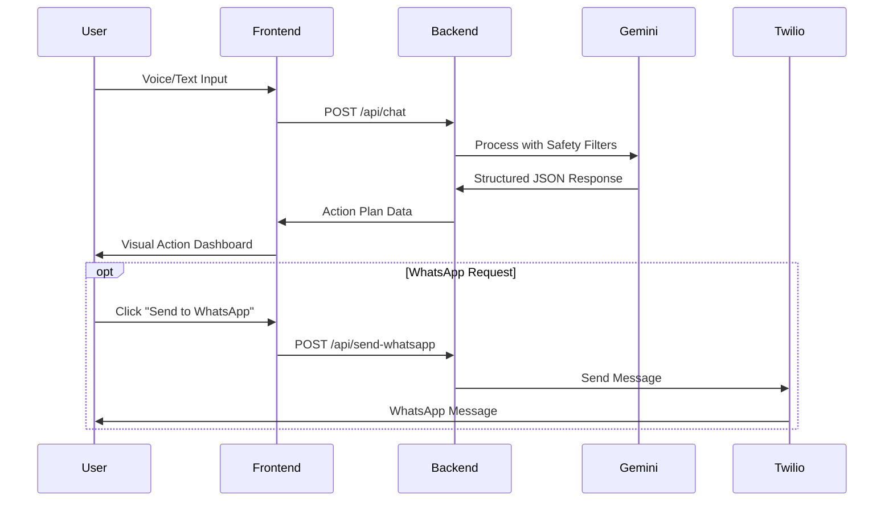

# Design Document: Bharat Seva

## Overview

Bharat Seva is a web-based AI-powered civic assistant that helps Indian citizens, particularly those in rural areas, navigate government bureaucracy and access civic services. The system follows a client-server architecture where the React frontend provides an accessible interface while the Node.js backend orchestrates AI processing through Google Gemini and external service integrations.

The core design philosophy emphasizes accessibility, multilingual support, and offline capability to serve users with varying literacy levels and limited internet connectivity. The system transforms complex government procedures into visual, step-by-step action plans that users can understand, save offline, or receive via WhatsApp.

## Architecture

### High-Level System Architecture



### Component Architecture

The system is organized into distinct layers:

1. **Presentation Layer**: React components handling user interaction, voice input, and visual display
2. **API Layer**: Express.js routes and controllers managing request/response flow
3. **Service Layer**: Business logic for AI processing, document generation, and external integrations
4. **Integration Layer**: Connectors for Gemini AI, Twilio, and other external services

### Data Flow



## Components and Interfaces

### Frontend Components

#### ActionDashboard Component
- **Purpose**: Displays government procedures as visual timeline
- **Props**: `actionSteps: ActionStep[]`, `language: string`, `currentStep?: number`
- **State**: Current step tracking, loading states
- **Key Features**: Timeline visualization, icon rendering, progress tracking

#### VoiceInterface Component
- **Purpose**: Handles voice input using Web Speech API
- **Props**: `onVoiceInput: (text: string) => void`, `language: string`
- **State**: Recording status, recognition results, error handling
- **Key Features**: Multi-language speech recognition, visual feedback, fallback to text

#### ContextChat Component
- **Purpose**: Provides step-specific assistance via side drawer
- **Props**: `currentStep: ActionStep`, `conversationHistory: Message[]`
- **State**: Chat messages, loading states, drawer visibility
- **Key Features**: Context-aware responses, conversation persistence

#### WhatsAppIntegration Component
- **Purpose**: Enables sharing action plans via WhatsApp
- **Props**: `actionPlan: ActionPlan`, `phoneNumber?: string`
- **State**: Sharing status, error messages
- **Key Features**: Message formatting, delivery confirmation

### Backend Services

#### ChatService
- **Purpose**: Orchestrates AI processing and response generation
- **Methods**: 
  - `processUserInput(input: string, language?: string): Promise<ActionPlan>`
  - `detectLanguageAndIntent(input: string): Promise<{language: string, intent: IntentType}>`
- **Dependencies**: GeminiService, SafetyFilter

#### GeminiService
- **Purpose**: Interfaces with Google Gemini API
- **Methods**:
  - `generateResponse(prompt: string, schema: JSONSchema): Promise<StructuredResponse>`
  - `detectLanguage(text: string): Promise<string>`
- **Configuration**: Model selection (gemini-2.5-flash-lite with fallback), safety settings

#### WhatsAppService
- **Purpose**: Manages Twilio integration for message delivery
- **Methods**:
  - `sendActionPlan(phoneNumber: string, actionPlan: ActionPlan): Promise<MessageResult>`
  - `formatForWhatsApp(actionPlan: ActionPlan): string`
- **Dependencies**: Twilio SDK

#### DocumentService
- **Purpose**: Generates offline-accessible documents
- **Methods**:
  - `generatePDF(actionPlan: ActionPlan): Promise<Buffer>`
  - `generateHTML(actionPlan: ActionPlan): Promise<string>`
- **Dependencies**: html-to-image, PDF generation libraries

### API Endpoints

#### POST /api/chat
- **Purpose**: Main endpoint for processing user queries
- **Request Body**: `{input: string, language?: string, sessionId?: string}`
- **Response**: `ActionPlan` object with structured steps
- **Error Handling**: Safety filter violations, AI service failures

#### POST /api/chat-context
- **Purpose**: Handles context-specific chat queries
- **Request Body**: `{message: string, currentStep: number, sessionId: string}`
- **Response**: `ContextResponse` with step-specific guidance
- **Error Handling**: Invalid step references, session timeouts

#### POST /api/send-whatsapp
- **Purpose**: Sends action plan summaries via WhatsApp
- **Request Body**: `{phoneNumber: string, actionPlanId: string}`
- **Response**: `{success: boolean, messageId?: string, error?: string}`
- **Error Handling**: Invalid phone numbers, Twilio service failures

## Data Models

### Core Data Structures

#### ActionPlan
```typescript
interface ActionPlan {
  id: string;
  title: string;
  description: string;
  language: string;
  intentType: 'grievance' | 'scheme';
  steps: ActionStep[];
  estimatedTime: string;
  requiredDocuments: Document[];
  createdAt: Date;
  expiresAt?: Date;
}
```

#### ActionStep
```typescript
interface ActionStep {
  stepNumber: number;
  title: string;
  description: string;
  icon: string;
  estimatedDuration: string;
  location?: string;
  requiredDocuments: string[];
  tips: string[];
  isCompleted: boolean;
}
```

#### Document
```typescript
interface Document {
  name: string;
  description: string;
  icon: string;
  isRequired: boolean;
  format: string;
  obtainmentSteps?: string[];
}
```

#### ContextMessage
```typescript
interface ContextMessage {
  id: string;
  content: string;
  role: 'user' | 'assistant';
  timestamp: Date;
  relatedStep?: number;
  language: string;
}
```

### AI Response Schema

#### Gemini Output Schema
```json
{
  "type": "object",
  "properties": {
    "intent": {
      "type": "string",
      "enum": ["grievance", "scheme"]
    },
    "language": {
      "type": "string"
    },
    "actionPlan": {
      "type": "object",
      "properties": {
        "title": {"type": "string"},
        "description": {"type": "string"},
        "steps": {
          "type": "array",
          "items": {
            "type": "object",
            "properties": {
              "stepNumber": {"type": "number"},
              "title": {"type": "string"},
              "description": {"type": "string"},
              "icon": {"type": "string"},
              "estimatedDuration": {"type": "string"},
              "location": {"type": "string"},
              "requiredDocuments": {
                "type": "array",
                "items": {"type": "string"}
              },
              "tips": {
                "type": "array",
                "items": {"type": "string"}
              }
            },
            "required": ["stepNumber", "title", "description", "icon"]
          }
        },
        "estimatedTime": {"type": "string"},
        "requiredDocuments": {
          "type": "array",
          "items": {
            "type": "object",
            "properties": {
              "name": {"type": "string"},
              "description": {"type": "string"},
              "icon": {"type": "string"},
              "isRequired": {"type": "boolean"}
            }
          }
        }
      },
      "required": ["title", "description", "steps"]
    }
  },
  "required": ["intent", "language", "actionPlan"]
}
```

### Session Management

#### UserSession
```typescript
interface UserSession {
  sessionId: string;
  userId?: string;
  language: string;
  currentActionPlan?: ActionPlan;
  conversationHistory: ContextMessage[];
  createdAt: Date;
  lastActivity: Date;
  preferences: UserPreferences;
}
```

#### UserPreferences
```typescript
interface UserPreferences {
  preferredLanguage: string;
  voiceEnabled: boolean;
  whatsappNumber?: string;
  accessibilityMode: boolean;
}
```

## Correctness Properties

*A property is a characteristic or behavior that should hold true across all valid executions of a system—essentially, a formal statement about what the system should do. Properties serve as the bridge between human-readable specifications and machine-verifiable correctness guarantees.*

### Property 1: Language Detection Accuracy
*For any* text input in a supported Indian language, the AI_Core language detection should correctly identify the language with high confidence.
**Validates: Requirements 1.1**

### Property 2: Intent Classification Completeness
*For any* user input related to government services, the AI_Core should classify it as either 'grievance' or 'scheme' without returning null or undefined classifications.
**Validates: Requirements 1.2**

### Property 3: Language Preservation Across Services
*For any* user interaction in a specific language, all system responses (AI responses, WhatsApp messages, chat responses) should maintain the same language consistently throughout the session.
**Validates: Requirements 1.3, 3.5, 5.5**

### Property 4: Supported Language Coverage
*For any* of the 10 required Indian languages (Hindi, English, Bengali, Telugu, Marathi, Tamil, Gujarati, Urdu, Kannada, Odia), the system should successfully process input and generate appropriate responses.
**Validates: Requirements 1.5**

### Property 5: Action Plan Step Count Bounds
*For any* valid government scheme query, the generated action plan should contain between 3 and 10 steps inclusive.
**Validates: Requirements 2.1**

### Property 6: Visual Element Completeness
*For any* generated action step or required document, the system should include both textual content and appropriate visual elements (icons, descriptions).
**Validates: Requirements 2.2, 2.3**

### Property 7: Step Chronological Ordering
*For any* generated action plan, the steps should be numbered sequentially starting from 1, with no gaps or duplicates in the sequence.
**Validates: Requirements 2.4**

### Property 8: Location Information for Office Steps
*For any* action step that involves visiting a government office, the step should include location information in the location field.
**Validates: Requirements 2.5**

### Property 9: WhatsApp Message Formatting
*For any* action plan sent via WhatsApp, the formatted message should be concise (under character limits), include essential information, and maintain mobile readability.
**Validates: Requirements 3.1, 3.2, 3.4**

### Property 10: Document Generation Completeness
*For any* action plan converted to a Smart_Document, the generated PDF should include all action steps, required documents, visual formatting, and a valid QR code linking to the online version.
**Validates: Requirements 4.1, 4.2, 4.3, 4.5**

### Property 11: Document Size Optimization
*For any* generated Smart_Document, the file size should remain within mobile-friendly limits while preserving all required content and visual elements.
**Validates: Requirements 4.4**

### Property 12: Context Chat Step Awareness
*For any* context chat interaction, the chat system should correctly identify and reference the user's current step when providing guidance.
**Validates: Requirements 5.1, 5.2**

### Property 13: Conversation History Persistence
*For any* user session, all context chat messages should be stored and retrievable throughout the session duration.
**Validates: Requirements 5.3**

### Property 14: Document Query Specificity
*For any* user question about required documents in context chat, the response should include specific formatting requirements and submission details.
**Validates: Requirements 5.4**

### Property 15: Voice Interface API Usage
*For any* voice input activation, the system should initialize and use the Web Speech API for speech recognition processing.
**Validates: Requirements 6.1**

### Property 16: Voice Interface Visual Feedback
*For any* voice recording session, the interface should display appropriate visual indicators during recording and processing states.
**Validates: Requirements 6.3**

### Property 17: Multi-language Voice Support
*For any* supported Indian language, the voice interface should successfully process speech input and convert it to text.
**Validates: Requirements 6.5**

### Property 18: Safety Filter Application
*For any* user input processed by the system, the safety filter should be applied before generating responses, blocking harmful content and logging security events.
**Validates: Requirements 7.1, 7.2, 7.3**

### Property 19: Safety Filter Explanations
*For any* blocked request due to safety filtering, the system should provide a clear explanation of why the request cannot be processed.
**Validates: Requirements 7.4**

### Property 20: Cross-Language Safety Consistency
*For any* harmful content input in different supported languages, the safety filter should consistently block the content regardless of the language used.
**Validates: Requirements 7.5**

### Property 21: Response Size Optimization
*For any* AI-generated response, the content should be optimized for minimal data transfer while maintaining all required information and accuracy.
**Validates: Requirements 8.2**

### Property 22: Caching Functionality
*For any* frequently accessed government scheme information, the system should store and retrieve data from local cache to improve performance.
**Validates: Requirements 8.5**

### Property 23: Government Scheme Coverage
*For any* query about major government schemes (PM Kisan, Ration Cards, employment programs), the AI_Core should have current information and generate appropriate action plans.
**Validates: Requirements 9.1, 9.2**

### Property 24: Eligibility Information Accuracy
*For any* scheme eligibility query, the response should include accurate criteria, requirements, and relevant deadlines when applicable.
**Validates: Requirements 9.3, 9.4**

### Property 25: Scheme Prioritization Logic
*For any* user situation where multiple government schemes apply, the system should prioritize schemes based on user needs and eligibility criteria.
**Validates: Requirements 9.5**

### Property 26: API Endpoint Availability
*For any* required API endpoint (/api/chat, /api/chat-context, /api/send-whatsapp), the endpoint should be accessible and return appropriate responses.
**Validates: Requirements 10.2**

### Property 27: JSON Schema Compliance
*For any* API response, the returned JSON should conform to the defined schema structure with all required fields present and correctly typed.
**Validates: Requirements 10.3**

### Property 28: API Error Handling
*For any* API request that encounters an error, the system should return appropriate HTTP status codes and structured error messages.
**Validates: Requirements 10.4**

## Error Handling

### AI Service Failures
- **Gemini API Unavailable**: Implement fallback to cached responses for common queries, display user-friendly error messages
- **Safety Filter Failures**: Default to blocking suspicious content, log incidents for manual review
- **Language Detection Failures**: Default to Hindi as specified in requirements, prompt user for language clarification

### External Service Failures
- **Twilio WhatsApp Service**: Display error message with alternative options (PDF download, email)
- **PDF Generation Failures**: Offer HTML version as fallback, maintain core functionality
- **Network Connectivity Issues**: Implement progressive degradation, cache critical functionality offline

### Input Validation Errors
- **Invalid Phone Numbers**: Validate format before Twilio integration, provide formatting guidance
- **Malformed Requests**: Return structured error responses with clear guidance for correction
- **Session Timeouts**: Gracefully handle expired sessions, offer to restart with preserved context

### Data Integrity
- **Corrupted Action Plans**: Validate generated plans against schema, regenerate if validation fails
- **Missing Required Fields**: Implement default values and validation at API boundaries
- **Inconsistent Language Data**: Maintain language consistency checks across all user interactions

## Testing Strategy

### Dual Testing Approach

The Bharat Seva system requires both unit testing and property-based testing to ensure comprehensive coverage:

**Unit Tests** focus on:
- Specific examples of government schemes (PM Kisan application flow)
- Edge cases like empty inputs, invalid phone numbers, network failures
- Integration points between React components and backend APIs
- Error conditions and fallback behaviors
- Specific language examples and formatting requirements

**Property-Based Tests** focus on:
- Universal properties that hold across all supported languages
- Action plan generation consistency across different scheme types
- Safety filtering effectiveness across various input types
- API response format validation across all endpoints
- Language preservation across all system interactions

### Property-Based Testing Configuration

**Testing Framework**: Use `fast-check` for JavaScript/TypeScript property-based testing
**Test Configuration**: Minimum 100 iterations per property test to ensure comprehensive input coverage
**Test Tagging**: Each property test must reference its design document property using the format:
`// Feature: bharat-seva, Property N: [property description]`

### Key Testing Areas

**Language Processing Tests**:
- Property tests for language detection across all 10 supported languages
- Unit tests for specific language edge cases and mixed-language inputs
- Integration tests for end-to-end language consistency

**AI Integration Tests**:
- Property tests for Gemini API response validation and schema compliance
- Unit tests for specific government scheme examples and error scenarios
- Mock tests for external service failures and fallback behaviors

**User Interface Tests**:
- Property tests for voice interface functionality across languages
- Unit tests for specific accessibility features and visual feedback
- Integration tests for component interaction and state management

**External Service Tests**:
- Property tests for WhatsApp message formatting and delivery
- Unit tests for Twilio integration error handling
- Mock tests for PDF generation and document formatting

Each correctness property listed above must be implemented as a single property-based test, ensuring that the universal behaviors hold across all valid inputs while unit tests validate specific examples and edge cases.